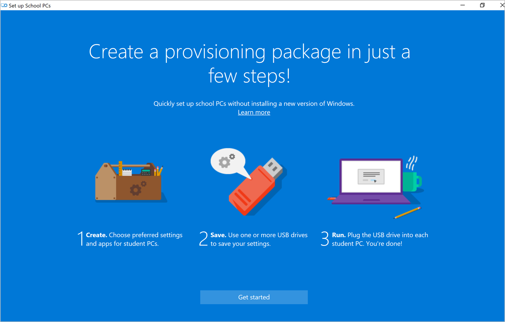

---
# required metadata

title: Add devices
titleSuffix: Intune for Education
description: Learn how to set up Windows 10 devices for Intune for Education.
keywords:
author: lenewsad
ms.author: lanewsad
manager: dougeby
ms.date: 06/18/2019
ms.topic: article
ms.prod:
ms.service: microsoft-intune
ms.technology:
ms.assetid: c884df47-61a9-4799-a407-8cd311d376d1
searchScope:
 - IntuneEDU

# optional metadata

#ROBOTS:
#audience:
#ms.devlang:
#ms.reviewer: travisj
#ms.suite: ems
#ms.tgt_pltfrm:
#ms.custom: intune-education

---

# Add Windows devices

After you've set up Intune for Education with your information — such as student records, apps, and settings for devices — connect the devices to Intune for Education. For new Windows 10 devices, a connection is established during initial device setup.

## Using Windows Autopilot vs Set up School PCs  
The following table describes when to use the Set up School PCs app and Windows Autopilot for initial device setup. Use the **Points to consider** column to consider your own school's environment and setup needs.    

|Points to consider  |Windows Autopilot  |Set up School Pcs|
|---------|---------|---------|  
|IT staff | Best for limiting IT staff intervention; unboxing, first power-on, and configuration of devices can be performed by students and teachers.|Best when unboxing, first power-on, and configuration of devices is performed by the IT Staff.|
|Device user| Best for single-user devices in user-driven mode and for older students.| Best for shared devices and for younger students.|
|Apps     | Works well with apps of all sizes.| Best for deploying large apps simultaneously on a slower network.|
|Network |  Reliable internet connection required; best if students are setting up the devices on their home network (Azure AD only). Consider the network impact of concurrent setup of multiple devices and the amount of data downloaded over the internet.|Reliable internet connection required; best for low bandwidth environments.|
|First day of class| Best if students need to unbox, connect to network, and wait for devices to configure.|Best if students need to use devices immediately.|
|Deployment time|Can take as little as a couple of minutes; depends on network speed and app size.|Can take as little as a couple of minutes; depends on network speed and app size.|
|OEMs/Partners|Requires registration of device IDs for the Windows Autopilot service by a partner (CSP) or OEM provider.|Not applicable.         |
|Existing on premises configuration    | Supports Hybrid AD join.| Supported with Windows Configuration Designer only.|   

## Setting up devices with Windows Autopilot
[Windows Autopilot](https://docs.microsoft.com/intune/enrollment-autopilot) is compatible with Intune for Education, but it has to be set up in Intune in the Azure portal. To set up your devices with Autopilot, go to [Intune](https://portal.azure.com) > Device enrollment > Windows enrollment > Devices.  

## Before you begin
During setup, devices must have access to the Internet. 

## Windows device setup
Complete the following steps to add your Windows 10 devices to Intune for Education.

1. Power on the new Windows 10 device. 
2. On a new or reset device, the first setup screen reads, **Lets start with region. Is this right?** Select the region where your PCs are located. Then select **Yes**.  

     

3. Choose a keyboard layout. This step configures the onscreen keyboard to match your keyboard's physical layout. It also configures language and keyboard characters. Select **Yes** to continue.  

        

4. If you want to add another keyboard layout, select **Add layout**. Otherwise, select **Skip**.   

       

5. Select **Set up for work or school**. Then select **Next**.  

       

6. Type the email address associated with your school's admin or enrollment manager account. Then select **Next**.  

       

7. Enter the password for the account. Then select **Next**.  

       

8. Choose privacy settings for the device. Configure these settings based on your school's policies. Some of the settings, such as **Speech recognition** and **Location** are turned on by default.  

       

9. Select **Accept** to finish device setup. It might take a few minutes to complete setup, so feel free to begin setup on another device.  

## Set up School PCs app
Add Windows devices to Intune through the Set up School PCs app. The app walks you through how to configure and save a single device profile that you can distribute to multiple PCs. A USB drive is used to save and download the profile to each device during device setup. 

For more information about the app, see the [What is Set up School PCs?](https://docs.microsoft.com/education/windows/use-set-up-school-pcs-app) article. 

     

 
