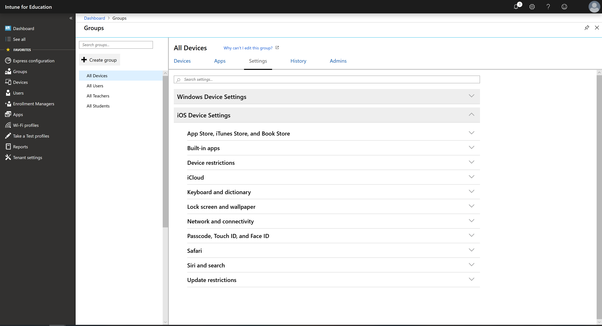

---
# required metadata

title: All iOS device settings
titleSuffix: Intune for Education
description: See a list of all iOS device settings in Intune for Education.
keywords:
author: lenewsad
ms.author: lanewsad
manager: dougeby
ms.date: 04/18/2019
ms.topic: article
ms.prod:
ms.service: microsoft-intune
ms.subservice: education
ms.technology:
ms.assetid: 2221009e-68cf-4171-8118-0d750b0f35f1
searchScope:
- IntuneEDU

# optional metadata

#ROBOTS:
#audience:
#ms.devlang:
#ms.reviewer: elcox
#ms.suite: ems
#ms.tgt_pltfrm:
#ms.custom: intune-education

---

# iOS device settings in Intune for Education  

> [!IMPORTANT]
> Can't see any iOS settings? If you find that the iOS dropdown is not visible or if it is disabled, [set up iOS device management](setup-ios-device-management.md). After setup is complete, all iOS controls will become enabled.

This article lists and describes all iOS device settings in Intune for Education. To view and edit these settings in the portal, click **Groups** >**Settings** > **iOS Device Settings**.   

     

## Apply settings to groups  
Apply [group settings](what-are-groups.md) to establish access and security boundaries on devices throughout your school. You can assign the same settings across all groups in your school; or you can customize the classroom experience and apply settings to individual groups.

## Configuration options  
Many settings in Intune for Education are configured to **Block** or **Allow**. For some settings, **Not configured** is an option. When toggled to **Not Configured**, the device will either:  
* Use the default setting. 
* Allow the device user (student or teacher) to customize the setting from their device.  

## App Store, iTunes Store, and Book Store   
|Setting|Description|
|---|---|
|Block App Store|Block students from accessing the App Store on school devices.|
|Require password to access App Store|Require the student to enter a password before they can access the App Store.|
|Block automatically downloading apps purchased on other devices|Block apps that were purchased on another school device from being downloaded to another device.|
|Block in-app purchases|Block attempts to make store purchases from within a running app.|
|Block explicit content in App Store and iTunes Store|Block students from accessing content rated as adult in the App Store.|
|Block downloading Apple Books content flagged as erotica|Block students from downloading books classified as erotica.|
|Block apps by age rating|Block students from downloading apps that don't meet the selected age rating.| 

## Built-in apps  
|Setting|Description|
|---|---|
|Block Camera|Block use of the camera on the device.|
|Block FaceTime|Blocks use of the FaceTime app on the device.|
|Block Game Center|Block use of the Game Center app on devices.|
|Block adding friends in Game Center|Block students from adding friends in the Game Center app.|
|Block Apple Music|Block use of the music streaming component of the Apple Music app on the device. |
|Block Radio in Apple Music|Block use of Radio in the Apple Music app on the device.|
|Block Messages|Block use of the Messages app on the device.|
|Block Apple News|Block use of the Apple News app on the device.|
|Block Apple Books|Block students from browsing and purchasing books in the Book Store.|
|Block Podcasts|Block use of the Podcasts app on the device.|
|Block changes to Find My Friends settings|Block students from changing settings for the Find My Friends app.| 
  
## Device restrictions  
|Setting|Description|
|---|---|  
|Block screenshots and screen recordings|Block students from capturing the contents of the screen as an image.|  
|Block changing device name|Block students from changing the name of the device.|
|Block app removal|Block students from uninstalling apps on their device.|
|Block changing wallpaper|Blocks students from changing the device lock screen and home screen image.|  
|Block changing notification settings|Block students from changing the device notification settings.| 
|Block changes to diagnostic data submission settings|Block students from changing if or how the device sends diagnostic data. |
 |Block changes to content and privacy restrictions|Block students from changing restrictions (parental controls) and Screen Time settings on the device.|
|Block manually installing configuration profiles |Block students from manually installing additional configuration profiles on the device.|
|Block button that erases all content and settings|Block students from erasing all content and settings on the device. The erase button becomes unavailable and can't be selected. |  
|Block untrusted TLS certificates|Block untrusted Transport Layer Security (TSL) certificates on the device.|  
|Block trusting apps from enterprise developers|Block use of the **Trust Enterprise Developer** button. When blocked, students can't trust and install apps from new enterprise authors. Students won't lose access to their existing enterprise apps. They can also still receive enterprise apps that are pushed through Intune. If you don't block this setting, students can trust and download apps from anyone.|
|Block changes to enterprise developer trust settings​|Block students from changing the certificate trust and app installation settings.| 
|Block changes to device account settings​|Block students from changing account-specific settings in the Settings app. Students can't create new device accounts or change their user name, password, or other settings associated with their account.|   
|Block remote screen observation through Classroom app​ |Block teachers from using the Classroom app to view their students' screens.|  
|Block unprompted screen observation through Classroom app​|Block teachers from using the Classroom app to view their students'screen, without student notification and approval.|  
|Allow Activation Lock|Enables Activation Lock on supervised devices when students and teachers turn on Find My iPhone. Activation Lock is an iOS feature that prevents people from reactivating a lost or stolen phone. When Activation Lock is on, the device user's Apple ID password is required to turn off Find My iPhone, erase the device, or reactivate the device.  |  

## iCloud  
|Setting|Description|  
|---|---|  
|Block iCloud backup|Block students from backing up devices to iCloud.|  
|Block syncing documents to iCloud|Block documents from syncing to an iCloud storage space.|  
|Require iCloud backups to be encrypted|Require any device backups to be encrypted.|  
|Block iCloud Photo Library|Block students from storing photos and videos in the cloud. Photos that aren't fully downloaded from iCloud Photo Library are removed from local storage. | 
|Block My Photo Stream|Block students from enabling My Photo Stream. My Photo Stream is an iOS feature that syncs recent (within the last 30 days) device photos to iCloud. Students can then view the photo stream on any device that has access to the iCloud account.|  
|Block Shared Albums|Block students from subscribing to or publishing shared albums in the Photos app.| 
|Block Handoff|Block students from continuing work they started on an iOS device, on another iOS device.|  

## Keyboard and dictionary  
|Setting|Description|  
|---|---|  
|Block keyboard spell-check|Block use of the device spell checker.|
|Block keyboard shortcuts|Block use of  keyboard shortcuts.|
|Block predictive keyboard suggestions|Block use of predictive keyboards that suggest words when typing.|
|Block Dictation|Block students from using voice input to enter text.|
|Block word definition lookup|Block the use of the iOS feature that lets you highlight a word and look up its definition.|
|Block word auto-correction|Block the device from automatically correcting misspelled words.|

## Lock screen and wallpaper  
|Setting|Description|
|---|---|
|Block notifications on lock screen|Block students from viewing notifications when the device is locked.|
|Block Siri while device is locked|Block students from using Siri, the iOS virtual assistant, when the device is locked.|
|Block access to Control Center from lock screen|Block students from accessing the Control Center app when the device is locked.|
|Block access to Wallet from lock screen|Block students from accessing the Wallet app when the device is locked.|
|Block Today View on lock screen|Block students from seeing the Today View when the device is locked.|
|Asset tag information|Apply a specific tag to all devices in a group. For example, **Owned by Contoso school district.** The tag appears on the device lock screen.| 
|Lock screen footnote|Applies your note or instruction on the lock screen so that if the device is lost and found, it can be returned accordingly. For example, **If found, call the Contoso school district at 555-555-5555.**
|Set device lock screen image| Choose a custom image to appear as the wallpaper for the device's lock screen.|
|Set device home screen image| Choose a custom image to appear as the wallpaper for the device's home screen.| 

## Network and connectivity
This section contains the settings for:
* Wireless connections  
* Wi-Fi profiles   
 
### Wireless connections  
|Setting|Description|
|---|---|
|Block changing Bluetooth settings|Block students from changing Bluetooth settings on the device.| 
|Block Personal Hotspot|Block students from using the device as a personal hotspot.|
|Block AirDrop|Block the use of the AirDrop feature. Students won't be able to exchange content with nearby devices.|

### Wi-Fi profiles   
|Setting|Description|
|---|---|
|Select iOS Wi-Fi profiles to assign them to this group.|A list of Wi-Fi profiles that you've created appear within this section, and are ready to assign. Visible details include the **Profile name**, **Network name (SSID)**, **Security type**, and **Description**.  

## Passcode, Touch ID, and Face ID  
|Setting|Description|
|---|---|  
|Require passcode|Require students to enter a passcode to unlock the device.|
|Block changing passcode|Block students from changing, adding, or removing the device passcode. |
|Minutes of inactivity before the screen locks|After the device remains idle for too long, its screen locks. To configure this setting, enter the maximum number of minutes that the device can be idle.|
|Minutes to wait before requiring passcode on lock screen|After the device remains idle for too long, the user must re-enter the device password to regain access. To configure this setting, enter the maximum number of minutes that the device can be idle.|
|Number of failed passcode attempts before wiping device|When someone exceeds the allowed number of sign-in attempts, the device erases all content and settings from the device, such as personal data, iOS software, email accounts, system and app settings, downloaded apps, and media. The device is restored to the way it was when it was first turned on. To configure this setting, enter the maximum number of sign-in attempts allowed.|  
|Block Touch ID and Face ID|Block students from using a fingerprint or facial recognition to unlock devices.|  
|Block changing Touch ID and Face ID settings|Block students from changing, adding, or removing TouchID and Face ID settings.| 

## Safari   
|Setting|Description|  
|---|---|  
|Block Safari|Block the Safari browser on the device.|  
|Block AutoFill|Block students from changing AutoFill settings in the browser.|  
|Block pop-ups|Block pop-ups that appear in the browser.| 
|Block cookies|Block the browser from using cookies.|  
|Require fraudulent website warnings|Show fraud warnings in the browser.|  

## Siri and search  
|Setting|Description|  
|---|---| 
|Block Siri|Block students from using Siri, the iOS voice assistant.|
|Block Siri profanity filter|Block Siri from dictating or speaking profane language.|
|Block Siri from searching for user-generated content|Block Siri from accessing websites to answer questions.|  
|Block Spotlight from returning Internet search results|Block Spotlight search from connecting the Internet to provide further results.|  

## Update restrictions  
|Setting|Description|
|---|---|
|Prevent devices from updating specific times|Stop device updates according to your day and time selections.|  

> [!NOTE]
> User, app, and device settings differ from [tenant settings](edu-tenant-general-settings.md). Tenant settings target the subscription and management settings at the organization's administrative level.  

## Next steps  
Configure your group, app, and device settings in the Intune for Education portal. If you haven't yet done it, go to [express configuration](edu-express-config-settings-ios.md) and set up your school with Microsoft-recommended settings.    
