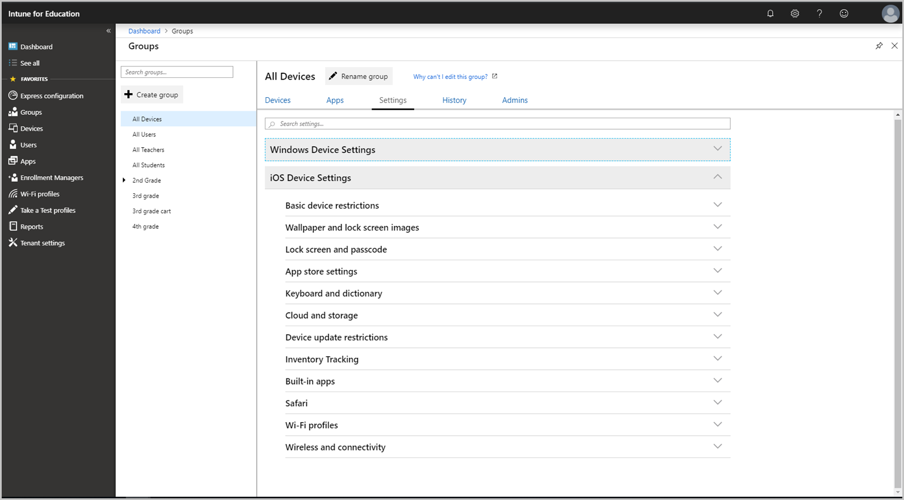

---
# required metadata

title: All iOS device settings
titleSuffix: Intune for Education
description: See a list of all iOS device settings in Intune for Education.
keywords:
author: lenewsad
ms.author: lanewsad
manager: dougeby
ms.date: 02/05/2019
ms.topic: article
ms.prod:
ms.service: microsoft-intune
ms.technology:
ms.assetid: 2221009e-68cf-4171-8118-0d750b0f35f1
searchScope:
- IntuneEDU

# optional metadata

#ROBOTS:
#audience:
#ms.devlang:
#ms.reviewer: rashok
#ms.suite: ems
#ms.tgt_pltfrm:
#ms.custom: intune-education

---

# iOS device settings in Intune for Education  

> [!IMPORTANT]
> Can't see any iOS settings? If you find that the iOS dropdown is not visible or if it is disabled, [set up iOS device management](setup-ios-device-management.md). After setup is complete, all iOS controls will become enabled.

This article lists and describes all iOS device settings in Intune for Education. To view and edit these settings in the portal, click **Groups** >**Settings** > **iOS Device Settings**.   

     

## Apply settings to groups  
Apply [group settings](what-are-groups.md) to establish access and security boundaries on devices throughout your school. You can assign the same settings across all groups in your school; or you can customize the classroom experience and apply settings to individual groups.

## Configuration options
Many settings in Intune for Education are configured to **Block** or **Allow**. For some settings, **Not configured** is an option. When toggled to **Not Configured**, the device will either:  
* Use the default setting. 
* Allow the device user (student or teacher) to customize the setting from their device.  
  
## Basic device restrictions  
|Setting|What it does|
|---|---|
|Block users from changing diagnostic data submission settings|Blocks students from changing if or how the device sends diagnostic data. |  
|Block screen capture|Block students from capturing the contents of the screen as an image.|  
|Block remote screen observation by Classroom app​ |Blocks the Apple Classroom app from viewing the screen of iOS devices.|  
|Block unprompted screen observation by Classroom app​|Blocks teachers from being able to observe student screens, without the students knowledge, through the Classroom app.|  
|Block untrusted TLS certificates|Blocks untrusted Transport Layer Security (TSL) certificates on the device.|  
|Block students from trusting enterprise developers in device settings​ |Blocks visibility of the **Trust Enterprise Developer** button from students; prevents devices from installing apps that are typically not from the iOS App Store, and often developed by your organization. This restriction won't apply if the app is from your organization's developer account and pushed through Intune for Education. It also won't revoke any trust that has already been granted.|
|Block users from changing trust enterprise developer app installation settings​|Block students from changing the app installation settings you've defined.|  
|Block users from changing device restrictions in device settings​|Block students from changing restrictions (parental controls) on the device.|  
|Block erasing content and settings|Block students from erasing all content and settings on the device.|  
|Block changing device name|Block students from changing the name of the device.|  
|Block changing notification settings|Block students from changing the device notification settings.|  
|Wallpaper modification |Blocks students from changing the device background image.|    
|Configuration profile changes |Block students from being able to install configuration profiles.||  
|Activation Lock|Block Activation Lock on supervised iOS devices.|  

## Wallpaper and lock screen images  

|Setting|What it does|
|---|---|
|Set device wallpaper image| Choose a custom image to appear as the wallpaper on the device's home screen.| 
|Set device lock screen image| Choose a custom image to appear in the background on the device's lock screen.|  

## Lock screen and passcode  

|Setting|What it does|
|---|---|
|Block notifications on lock screen|Block students from viewing notifications when device is locked.|
|Control Center access on lock screen|Block student from accessing the control center app when device is locked.|
|Block Siri on lock screen|Block the use of Siri when device is locked.|
|Block access to Wallet from lock screen|Block access to the Wallet app when device is locked.|
|Block Today view on lock screen|Block students from seeing the Today view when device is locked.|
|Require passcode|Require students to enter a passcode to unlock device.|
|Block changing passcode|Block students from changing, adding, or removing device passcode. |
|Minutes of inactivity before the screen locks|Specifies the number of minutes the device can remain idle before the device screen locks.|
|Minutes to wait before requiring passcode on lock screen|Specifies how long the device can remain idle before the student must re-enter device password.|
|Number of failed passcode attempts before wiping device|Specifies the number of unique, bad password attempts allowed before the student must re-enter device password.
|Block fingerprint unlock|Block students from using a fingerprint to unlock devices.|
|Block changing registered fingerprint settings|Block students from changing, adding, or removing TouchID settings.|  

## App Store settings  

Setting|What it does|
|---|---|
|Block App Store|Block students from accessing the App Store on school devices.|
|Require password to access App Store|Require the student to enter a password before they can access the App Store.|
|Block automatically downloading apps purchased on other devices|Block apps that were purchased on another school device from being downloaded to another device.|
|Block in-app purchases|Block attempts to make store purchases from within a running app.|
|Block explicit content in iTunes and the App Store|Block students from accessing content rated as adult in the App Store.|
|Block downloading iBook content flagged as erotica|Block students from downloading books classified as erotica.|
|Block Game Center|Block the use of the Game Center app on devices.|
|Block adding friends in Game Center|Block students from adding friends in the Game Center app.|

## Keyboard and dictionary  

|Setting|What it does|  
|---|---|  
|Block looking up word definitions|Block the use of the iOS feature that lets you highlight a word and look up its definition.|
|Block predictive keyboard suggestions|Block the use of predictive keyboards that suggest words when typing.|
|Block auto-correction|Block the device from automatically correcting misspelled words.|
|Block keyboard spell-check|Block the device spell checker.|
|Block keyboard shortcuts|Block the use of keyboard shortcuts.|
|Block keyboard dictation|Block students from being able to use voice input to enter text.|

## Cloud and storage  

|Setting|What it does|  
|---|---|  
|Block iCloud backup|Block students from backing up devices to iCloud.|  
|Block syncing documents to iCloud|Block documents from syncing to an iCloud storage space.|  
|Block Photo Stream|Block students from enabling My Photo Stream. Students cannot sync photos to iCloud and share across all school devices.|  
|Require iCloud backups to be encrypted|Required any device backups to be encrypted.|  
|Block iCloud Photo Library|Blocks the use of iCloud photo library. Students cannot store photos and videos in the cloud. Any photos from iCloud Photo Library that are not fully downloaded to the device are removed from the device. |  
|Block shared Photo Stream|Blocks iCloud Photo Sharing on the device.|  
|Block Handoff|Blocks the user from continuing work they started on an iOS device, on another iOS device.|  

## Device update restrictions

|Setting|What it does|
|---|---|
|Prevent devices from updating specific times|Stops device updates according to your day and time selections.|  

## Inventory tracking  

|Setting|What it does|
|---|---|
|Asset tag information|Applies your specified tag to all devices in a group. For example, "Owned by Contoso school district."|
|Lock screen footnote|If the device is lost, it displays a note or instructions to help get it returned to your school. For example, "If found, call the Contoso school district at 555-555-5555."

## Built-in apps  

|Setting|What it does|
|---|---|
|Block Camera|Blocks the use of the camera on the device.|
|Block FaceTime|Blocks use of the FaceTime app on the device.|
|Block Siri|Blocks use of the Siri voice assistant on the device.|
|Block Siri profanity filter|Blocks Siri from dictating or speaking profane language.|
|Block Siri from searching for user-generated content|Blocks Siri from accessing websites to answer questions.|
|Block Spotlight from searching for user-generated content|Block Spotlight search from connecting the Internet to provide further results.|
|Block Apple News|Block use of the Apple News app on the device.|
|Block iBooks Store|Block students from being able to browse and purchase books from the iBooks store.|
|Block Messages app|Block use of the Messages app on the device.|
|Block Podcasts app|Block use of the Podcasts app on the device.|
|Block Apple Music|Block use of the Apple Music app on the device.|
|Block iTunes Radio|Block use of the iTunes Radio app on the device.|
|Block changes to Find My Friends app settings|Block students from changing settings for the Find My Friends app.|  

## Safari  

|Setting|What it does|  
|---|---|  
|Block Safari|Block the Safari browser on the device.|  
|Block autofill|Block students from changing autofill settings in the browser.|  
|Block cookies|Block the browser from using cookies.|  
|Show warning when visiting a fraudulent website|Shows fraud warnings in the browser.|  
|Block pop-ups|Block pop-ups that appear in the browser.|  

## Wi-Fi profiles  
Select from the list of Wi-Fi profiles to assign one or more profiles to the group.  

## Wireless and connectivity  

|Setting|What it does|
|---|---|
|Block AirDrop|Block the use of the AirDrop feature. Students will not be able to exchange content with nearby devices.|
|Block Personal Hotspot|Block students from using the device as a personal hotspot.|
|Block changing Bluetooth settings|Block students from changing Bluetooth settings on the device.|   

> [!NOTE]
> User, app, and device settings differ from [tenant settings](edu-tenant-general-settings.md). Tenant settings target the subscription and management settings at the organization's administrative level.  

## Next steps
Configure your group, app, and device settings in the Intune for Education portal. If you haven't yet done it, go to [express configuration](edu-express-config-settings-ios.md) and set up your school with Microsoft-recommended settings.    
