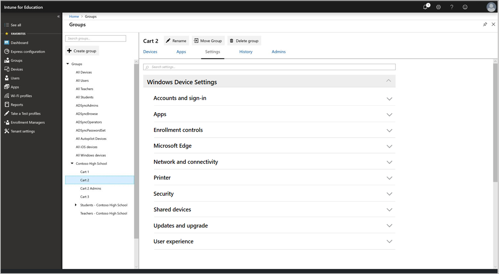

---
# required metadata

title: All Windows 10 device settings
titleSuffix: Intune for Education
description: See a list of all Windows 10 device settings in Intune for Education
keywords:
author: lenewsad
ms.author: lanewsad
manager: dougeby
ms.date: 01/10/2018
ms.topic: article
ms.prod:
ms.service: microsoft-intune
ms.technology:
ms.assetid: 2221009e-68cf-4171-8118-0d750b0f35f1
searchScope:
- IntuneEDU

# optional metadata

#ROBOTS:
#audience:
#ms.devlang:
#ms.reviewer: rashok
#ms.suite: ems
#ms.tgt_pltfrm:
#ms.custom: intune-education

---

# Windows 10 device settings in Intune for Education

This article lists and describes all Windows device settings in Intune for Education. To view and edit these settings in the portal, click **Groups** > **Settings** > **Windows Device Settings**.  

     

## Apply settings  
Apply [group settings](what-are-groups.md) to establish access and security boundaries on devices throughout your school. You can assign the same settings across all groups in your school; or you can customize the classroom experience and apply settings to individual groups.  

## Configuration options  
Many settings in Intune for Education are configured to **Block** or **Allow**. For some settings, **Not configured** is an option. When toggled to **Not Configured**, the device will either:  
* Use the default setting. 
* Allow the device user (student or teacher) to customize the setting from their device.    

> [!NOTE]
> User, app, and device settings differ from [tenant settings](edu-tenant-general-settings.md). Tenant settings address the subscription and management settings for your organization.

## Apps  
Configure settings such as how users obtain and access apps on their devices.  

|Setting|What it does|
|---|---|
|Remove built-in Windows 10 apps|Uninstall certain built-in Windows apps. Learn what those apps are [below](all-edu-settings-windows.md#remove-built-in-apps).| 
|Block access to administrative apps|Blocks students from opening apps that require administrative privileges.|
|Block installing apps from the Microsoft Store for Education|Block users from installing apps from unauthorized locations.|
|Require Microsoft Store for Education apps to be installed from the private store|Only allow users to install apps from the Microsoft Store for Education that your organization has set up.|
|Trusted apps|Allow or block users from installing trusted apps that have signed certificates from Microsoft.|
|Untrusted apps|Allow or block users from installing apps with certificates that are unsigned, or signed by sources not trusted by Microsoft.|
|Block installing apps from places other than the Microsoft Store for Education|Block users from installing apps from other sources and app stores.
|Block automatic app updates for Microsoft Store for Education|Block Microsoft Store for Education apps from being updated automatically.|
|Enable students on shared device to share app data|Enables students to share and send app data between devices.|  

## Enrollment controls  
Configure settings related to Intune for Education device enrollment.

|Setting|What it does|
|---|---|
|Block manual unenrollment|Block users from manually unenrolling devices from management.|
|Enable Autopilot Reset| Enable users with administrative rights to press CTRL+ Win + R on the device lock screen to trigger Autopilot Reset. Autopilot Reset removes all user data&ndash;including user-installed apps and personal settings&ndash;and keeps the device enrolled in Intune. As a result, the device is kept up-to-date with all of the latest apps, policies, and settings.|
|Block adding provisioning packages|Block users from adding new provisioning packages that have device settings.|
|Block removing provisioning packages|Block users from removing provisioning packages that have device settings.|  

## Microsoft Edge  
Configure settings that affect the Microsoft Edge browser experience and user data.

### Browser experience  
|Setting|What it does|
|---|---|
|Configure homepages|Choose what page opens every time someone begins a new Microsoft Edge browser session.|
|Configure new tab page|Choose what page opens every time someone opens a new tab in Microsoft Edge.|
|Configure home button behavior|Choose what page appears when users click the home button in Microsoft Edge. You can also hide the home button.|
|Block editing favorites|Block users from adding, importing, sorting, or editing the Favorites list.|
|Block address bar suggestions|Block Microsoft Edge from suggesting possible search terms or previously visited websites as you type a URL or search term.|
|Block search suggestions|Block Microsoft Edge from suggesting possible websites as you type a URL or search term.|
|Block InPrivate browsing|Block users from using InPrivate browsing, which stops Microsoft Edge from saving data like browsing history and cookies.| 
|Block browser extensions|Block users from using extensions to customize Microsoft Edge with added functionality from Microsoft and other sources.|
|Block untrusted browser extensions|Block users from sideloading extensions to their Microsoft Edge browser. These extensions are installed from untrusted sources&ndash;not the Microsoft Store&ndash;and could be malware.|
|Block printing from Microsoft Edge|Blocks users from printing browser content.|
|Block First Run page|Block users from seeing the First Run page. Microsoft Edge First Run page appears when a user opens Microsoft Edge for the first time and after browser updates.|
|Block pop-ups|Block websites from opening new windows.|
|Block overriding security warnings|Block users from clicking "Go on to the webpage" on sites that show an SSL/TLS certificate error.|
|Block password manager|Block users from using the password manager to save passwords.|
|Block automatically filling form entries|Block saving data entered in a form field online.|
|Block access to about:flags page|Block access to the about:flags page, which contains experimental settings and features.|
|Require intranet sites to be viewed in Internet Explorer|If set to “Block”, internal traffic is sent to Microsoft Edge instead of Internet Explorer.|
|Block Prelaunch|Microsoft Edge Prelaunch opens Microsoft Edge as a background process during Windows startup. This action helps the performance of Microsoft Edge and minimizes the amount of time required to start it. However, running Microsoft Edge as a background process might make devices appear as *not compliant* in your secure assessments.| 
|Default search engine|Select Bing, Yahoo, or Google as the default search engine for Microsoft Edge.|  

### User data  
|Setting|What it does|
|---|---|
|Block Developer Tools|Block users from accessing Developer Tools. Microsoft Edge Developer Tools enable users to build and debug webpages|
|Sync Microsoft Edge favorites with Internet Explorer|Sync all favorites from Microsoft Edge to Internet Explorer.| 
|Clear browsing data upon exit|Automatically erase history, cookies, and cached files after closing Microsoft Edge.|
|Use cookies|Cookies can store website settings or track user’s browsing behavior.|

## Network and connectivity   
Configure network and connectivity settings for:    
* Bluetooth  
* Internet connectivity restrictions  
* Proxy  
* Wi-Fi profiles  

### Bluetooth  
|Setting|What it does|
|---|---|
|Block Bluetooth|Block devices from using Bluetooth.|
|Block Bluetooth discoverability|Block devices from being set as discoverable using Bluetooth.|
|Block receiving advertisements over Bluetooth|Block devices from receiving advertisements onscreen while using Bluetooth.|  
|Block Bluetooth Swift Pair notifications|Block users from getting notifications about Bluetooth device pairing. Swift Pair lets users know when Bluetooth devices are nearby and able to connect to Windows 10.|  

### Internet connectivity restrictions  
|Setting|What it does|
|---|---|
|Block Internet Connection Sharing|Block users from using Internet Connection Sharing to share the device’s Internet connection with other devices.|
|Block using Wi-Fi Sense to automatically connect to open Wi-Fi hotspots|Choose whether to block devices from automatically connecting to Wi-Fi hotspots.|
|Block cellular data while roaming|Block the use of cellular data when device is roaming.|  

### Proxy  
|Setting|What it does|
|---|---|
|Block automatic detection of proxy settings|If you've set up a proxy to handle device network traffic, you can choose whether devices automatically detect the proxy settings when connected.|
|Use proxy script|Enable the use of a proxy script for your devices. If you **Allow** this setting, you need to provide a **Setup script address**.|
|Use manual proxy server configuration|If you've set up a manual proxy, you can define settings for it here. If you **Allow** this setting, you need to provide the **Proxy server address**, **Port**, **Proxy exceptions**, and whether to **Use proxy server for local (intranet) connections**.|  

### Wi-Fi profiles  

|Setting|What it does|
|---|---|
|Select Windows Wi-Fi profiles to assign them to this group.|A list of Wi-Fi profiles that you've created appear within this section, and are ready to assign. Details visible include the **Profile name**, **Network name (SSID)**, **Security type**, and **Description**. 

> [!NOTE]
> Configure a WPA-2 Enterprise Wi-Fi network using the [full Wi-Fi profile management experience in Intune](https://docs.microsoft.com//intune/wi-fi-settings-import-windows-8-1). You can also use Intune to set up [SCEP](https://docs.microsoft.com/intune/certificates-scep-configure) and [PKI](https://docs.microsoft.com/intune/certficates-pfx-configure) integration.   

## Printer   
Configure settings to allow printer access from school devices.    

|Setting|What it does|
|---|---|
|Printer list|Create a list of printers that you want to make available to student devices. Enter the printer hostname or IP address. An example of a formatted hostname is *printer1.contososd.edu*. An example of a formatted IP address is *75.121.7.31*.| 
|Specify default printer|Make a printer available as the default printer option on devices. Enter the printer hostname or IP address as it appears in your **Printer list**.|  
|Block adding new printers|Block groups from connecting new printers to their devices.|  

## Security  
Configure security settings for Windows Defender and Windows SmartScreen.  

### Windows Defender  
> [!NOTE]
> Some Windows Defender settings are available only at the [tenant](edu-tenant-general-settings.md) level and are not shown in the portal.  

|Setting|What it does|
|---|---|
|Block user access to Windows Defender settings|Block users from modifying Windows Defender settings on the device.|
|Enable real-time monitoring|Enable always-on scanning for malware, spyware, and other threats.|
|Enable behavior monitoring|Enable Windows Defender to check for certain known patterns of suspicious activity.|
|Prompt users to submit suspicious files to Microsoft|Choose to automatically send files to Microsoft for further analysis.|
|Type of system scan to perform|Choose if Windows Defender does a quick scan, a full scan, or no scan on devices.|
|Scan all downloaded files|Automatically scan all downloaded files for malware.|
|Scan scripts run in Microsoft web browsers|Scan all scripts a website attempts to run in Microsoft Edge and Internet Explorer.|
|Scan removable drives during full scan|Include removable drives, such as USB sticks, during full scans.|
|Scan files opened over the network|Scan all files that are opened by users from websites while using the network.|
|Scan remote folders during full scan|Scan any folders on remote locations during full scans.|
|Scan archive files|Scan archive files, like .zip or .rar.|
|Scan incoming email|Scan all email received over the network.|
|Scan for malware when files or programs are opened|Scan for malware when a file or program opens and alert users about suspicious activity.|
|Days before quarantined malware is removed| Set the number of days an affected file is saved. After this number of days, the file is deleted. For example, if set to 0, the file is immediately deleted.|
|Set anti-malware update frequency|Select how frequently Windows Defender should check for and download anti-malware updates.|
|Potentially Unwanted Applications protection|Defender alerts the user and blocks potentially unwanted software that attempts to install itself on devices.|
|Block suspicious files|If this setting is configured, Windows Defender Antivirus will be more aggressive about identifying suspicious files to block and scan. When not configured, it will block and scan less frequently. You can select **Not configured**, **High**, **High plus**, and **Zero tolerance**. **High** aggressively blocks unknown files while minimizing impact to device performance. **High plus** aggressively blocks unknown files, but may negatively impact device performance. **Zero tolerance** blocks all unknown files from running.|
|Enable cloud-delivered protection|Get real-time protection when Windows Defender sends info to Microsoft about potential security threats. This feature works best with **Prompt users to submit suspicious files to Microsoft** set to automatically send files.|
|Actions on detected malware threats|Windows Defender automatically quarantines detected malware.|
|Enable Network Inspection Service|Helps protect devices against network-based exploits. Uses the signatures of known vulnerabilities from the Microsoft Endpoint Protection Center to help detect and block malicious traffic.|
|Exclude files with these extensions from scans and real-time protection|Define the types of files that users can open without scanning for security threats.
|Exclude processes from scans and real-time protection|Define the types of processes that users can run without scanning for security threats.
|Exclude directories from scans and real-time protection|Define the file locations that users can access without scanning for security threats.|   

### Windows SmartScreen  

|Setting|What it does|
|---|---|
|Block users from overriding SmartScreen warnings about websites|Block users from ignoring and accessing websites blocked by the SmartScreen Filter.|
|Block users from overriding SmartScreen warnings about downloads from the web|Block users from ignoring and downloading unverified files that SmartScreen Filter warns about.|
|Enable SmartScreen to check for unrecognized apps and files|Enables SmartScreen to protect devices by checking for unrecognized apps and fBlock users from dismissing SmartScreen warningsiles from the web.|
|Block users from overriding SmartScreen warnings about apps and files|Blocks students from dismissing SmartScreen warnings about potentially malicious files and apps.|

## Shared devices  
Configure settings that control how teachers and students share devices.

|Setting|What it does|
|---|---|
|Optimize devices for shared use|Configures recommended settings for shared devices, such as power and update management. Allows multiple students or teachers to sign in to the same device.|
|Block guest users| This option is only available when you enable **Optimize devices for shared use**. Block guest users from signing in to shared devices. When blocked, only domain users can sign in.|  
|Block access to local storage| This option is only available when you enable **Optimize devices for shared use**. Blocks users from saving files to the device. When blocked, users can only save to the cloud. | 
|Block fast user switching|Allow users to quickly switch between user accounts from the Start menu.|  

### Remove built-in apps  

When you select to optimize devices for shared use, these apps will be removed from teacher and student computers:

* 3DBuilder
* Bing Weather
* Desktop App Installer
* Get Started
* Microsoft Office Hub
* Solitaire Collection
* One Connect
* Windows Feedback Hub
* Xbox
* Groove Music
* Mail
* Calendar

## Accounts and sign-in  
Configure how users sign in to school devices.

|Setting|What it does|
|---|---|
|Block signing in using a Microsoft account|Block users from signing in with their Microsoft account.|
|Block adding new non-Microsoft accounts|Block users from adding any account other than their Microsoft account. Use this setting if you want to force users to only use their Microsoft accounts for email.| 
|Configure preferred Azure Active Directory tenant domain|Enables users to sign in to Windows without typing the domain name. If you configure this setting, the tenant domain name will prepopulate, but is still editable.| 

## Updates and upgrade
Configure how devices receive updates and upgrades.    

### Updates  

|Setting|What it does|
|---|---|
|Branch readiness level|Choose if devices are on Current Branch or Current Branch for Business for Windows updates.|
|Configure how and when updates are installed|Set the updates and maintenance period for the installation of updates.|
|Days to defer feature updates after they become available (0-365)|Set how many days to wait to apply a feature update after it becomes available. For example, if set to 0 days, a feature update that's just become available will be immediately applied to your devices.|
|Days to defer quality updates after they become available (0-30)|Set how many days to wait to apply a quality update after it becomes available. For example, if set to 0 days, a quality update that's just become available will be immediately applied to your devices.|
|Days before deleting uninstall files (2-60)|After installing feature updates, Windows keeps the files necessary to uninstall the new build and revert to your previous one. Set how many days to wait to uninstall these files.|
|Block pausing Windows Update|Blocks user access to the Pause updates feature.|
|Allow students to see Windows 10 pre-release features|Choose if students can see pre-release features for settings, pre-release features for settings and experimentation, or no pre-release features.|
|Delivery optimization mode|Select how you want to deliver updates to devices.|  

### Upgrade
|Setting|What it does|
|---|---|
|Windows Edition to upgrade to| Upgrade the devices in this group to a different edition of Windows 10. Select the **Edition to upgrade to** and enter the **Product key**.|
|Switch out of S Mode|Previously referred to as Windows 10 S, S Mode is a more secure version of Windows 10. This setting lets users switch their devices out of S Mode. **Keep in S Mode** prevents them from making the switch. When in S mode, teachers and students can only browse with Microsoft Edge, and download apps from Microsoft Store.|

## User experience   
Configure the user experience settings for:   

  * Device restrictions  
  * Lock screen and desktop  
  * Settings app  
  * Start menu  

### Device restrictions  

|Setting|What it does|
|---|---|
|Block camera|Block user access to the device camera.|
|Block OneDrive file sync|Block OneDrive Sync for these devices and users.|
|Block removable storage|Block users from using removable storage such as USB drives and external hard drives.|
|Block Cortana|Block Cortana, the digital assistant built into Windows 10 that can answer questions and perform tasks.|
|Block location services|Block apps from using location services to access the device’s location.|  
|Block changing date and time settings|Block users from changing the device date and time settings.|
|Block changing language settings|Block users from changing the device language.|
|Block changing device region settings|Block users from changing region settings, such as country and language.|
|Block changing power and sleep settings|Block users from changing power and sleep settings.|
|Block ending tasks in Task Manager|Block users from ending tasks that force specific programs to close.|
|Send diagnostic data|Define whether to collect and send anonymous usage data to Microsoft to help improve Windows.|  

### Lock screen and desktop  

|Setting|What it does|
|---|---|
|Set custom lock screen image|Configure a custom background image on the sign-in screen. You can choose a .jpg or .png less than 20 MB in size.|
|Set custom desktop image|Configure a custom background image on the desktop. You can choose a .jpg or .png less than 20 MB in size.|
|Block Windows Spotlight|Block all Windows Spotlight features on these devices.|
|Block toast notifications on lock screen|Block notifications from appearing on the screen of a locked device.|
|Block Cortana on lock screen|Prevent users from accessing Cortana from the lock screen.|

### Settings app  

|Setting|What it does|
|---|---|
|Block user access to Settings app|Block user access to the entire Settings app. To block only parts of the app, select from the other settings in this section.
|System settings|Block display, notifications, apps, power settings.|
|Devices|Block Bluetooth, printers, and more.|
|Network & Internet|Block Wi-Fi, airplane mode, and VPN.|
|Personalization|Block background, lock screen, and color modifications.|
|Accounts|Block user accounts, email, sync, work, and other people.|
|Time & language|Block size, region, and date.|
|Ease of Access|Block Narrator, magnifier, and high contrast.|
|Privacy|Block location and camera.|
|Update & security|Block Windows Update, recovery, and backup.|  
|Apps|Block uninstall, defaults, and optional features.|
|Gaming|Block game bar, DVR, broadcasting, and Game Mode.|  

### Start menu  

|Setting|What it does|
|---|---|
|Force Start menu size|Define whether to force the Start menu to appear full screen.|
|Block Jump Lists in Start menu from showing recently opened programs|Block a user's recently opened items from appearing in a Jump List in the Start menu and taskbar.|
|Block showing recently added apps in Start menu|Block recently added apps from showing in the Start menu.|
|Block showing the most used apps in Start menu|Block the most used apps from showing in the Start menu.|
|Block app list in the Start menu|Block the list of all apps on the device from showing in the Start menu.|
|Block power menu in the Start menu|Block the power menu (for example, Restart, Shut down) from showing in the Start menu.|
|Block user tile in the Start menu|Block the current user’s information from being shown in the Start menu.|
|Block options from appearing on the user tile in the Start menu|You can choose **Change account settings**, **Lock**, and **Sign out**.|
|Choose folders that appear in the Start menu|You can choose **File Explorer**, **Settings**, **Documents**, **Downloads**, **Music**, **Pictures**, **Videos**, **HomeGroup**, **Network**, and **Personal Folder**.|
|Apply custom Start menu layout|Apply a custom Start menu layout using an XML file. You can upload an .xml file less than 2 MB in size.|
|Pin websites as tiles in the Start menu|Pin websites as tiles in the Start menu using an XML file. You can upload an .xml file less than 2 MB in size.|  

## Next steps  
Configure your group, app, and device settings in the Intune for Education portal. If you haven't yet done it, go to [express configuration](edu-express-config-settings-windows.md) and set up your school with Microsoft-recommended settings.  

Need help with managing devices? [Assign group admins](group-admin-delegate.md) in your school to help you manage device settings.  

[Find out more about the full Windows 10 settings management experience available in Intune](https://docs.microsoft.com/intune/deploy-use/windows-10-policy-settings-in-microsoft-intune)
