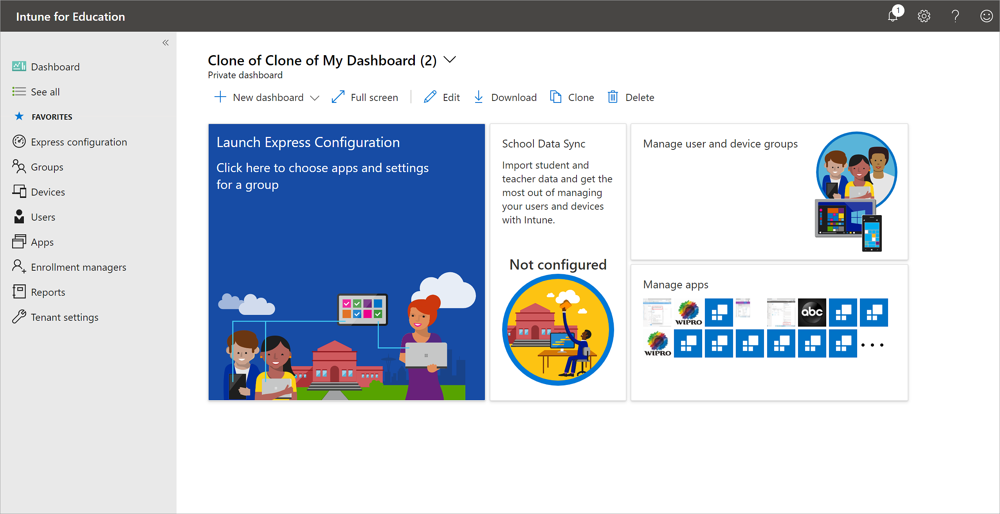
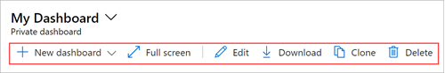
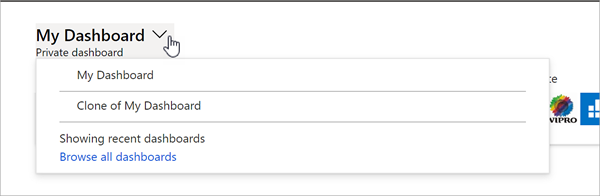
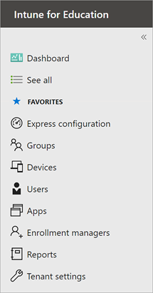
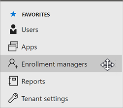

---
# required metadata

title: Navigate the Intune for Education dashboard
titleSuffix: Intune for Education
description: Learn how to use the Intune for Education dashboard and sidebar to make navigating easier.
keywords:
author: lenewsad
ms.author: lanewsad
manager: dougeby
ms.date: 01/22/2021
ms.topic: article
ms.prod:
ms.service: microsoft-intune
ms.subservice: education
ms.technology:
ms.assetid: ce79202e-e6b4-4e1d-b0e5-26496f9e49a2
searchScope:
- IntuneEDU

# optional metadata

#ROBOTS:
#audience:
#ms.devlang:
#ms.reviewer: travisj
#ms.suite: ems
#ms.tgt_pltfrm:
#ms.custom: intune-education

---

# Navigate your dashboard

Your _dashboard_ is the main landing page for Intune for Education. It's where you begin every time you sign in, and it's the starting point to manage your users, apps, and devices.  

  

## Dashboard defaults and customizations  
The default dashboard shows the following tiles to help get you started with essential device management tasks:

* Launch Express Configuration
* School Data Sync
* Manage user and device groups
* Manage apps

Some tiles, such as School Data Sync and Manage apps, show metrics like configuration status and current app inventory.

You can use the dashboard tools to expand, edit, download, clone, or delete your dashboard. 

     

Select **New dashboard** to create a dashboard from scratch. Creating a new dashboard doesn't overwrite or remove existing dashboards. Select the arrow next to the current dashboard name to access your other dashboards.  

     

## Sidebar  

Every page in Intune for Education has a  _sidebar_ from which you can access the management areas of the portal.  Select **See all** to view additional areas and services in Intune for Education that aren't listed. 

  

To reorder the links in your sidebar, hover your cursor over the right-side of a link. Then press and drag to reposition the service.  

    

  ## Next steps  

  Go through Express Configuration to quickly set up users and devices with the essential configurations. For more information, see [Express configuration in Intune for Education](express-configuration-intune-edu.md).   

