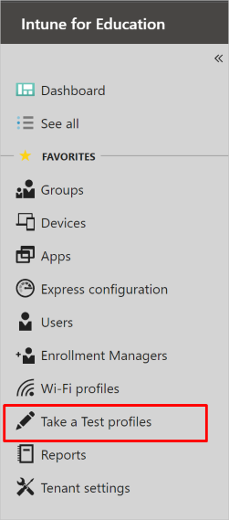
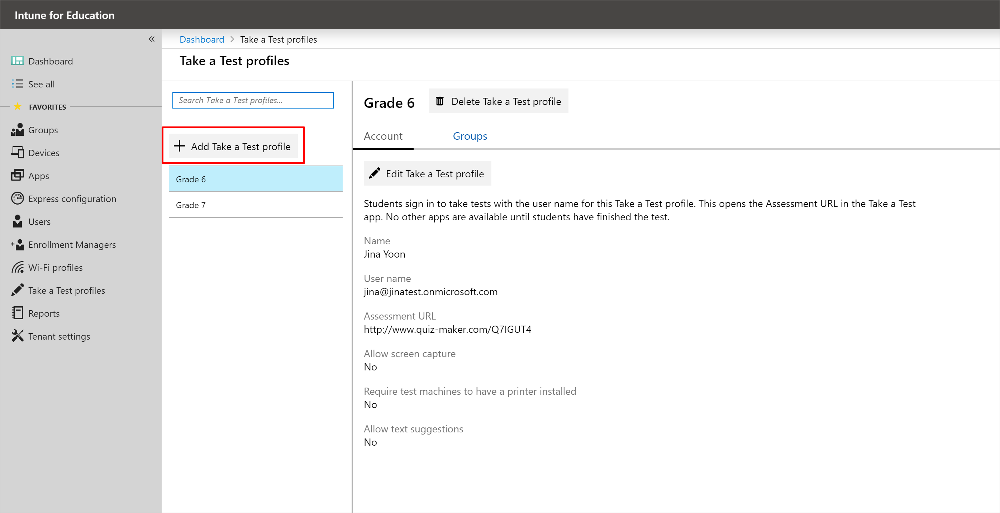
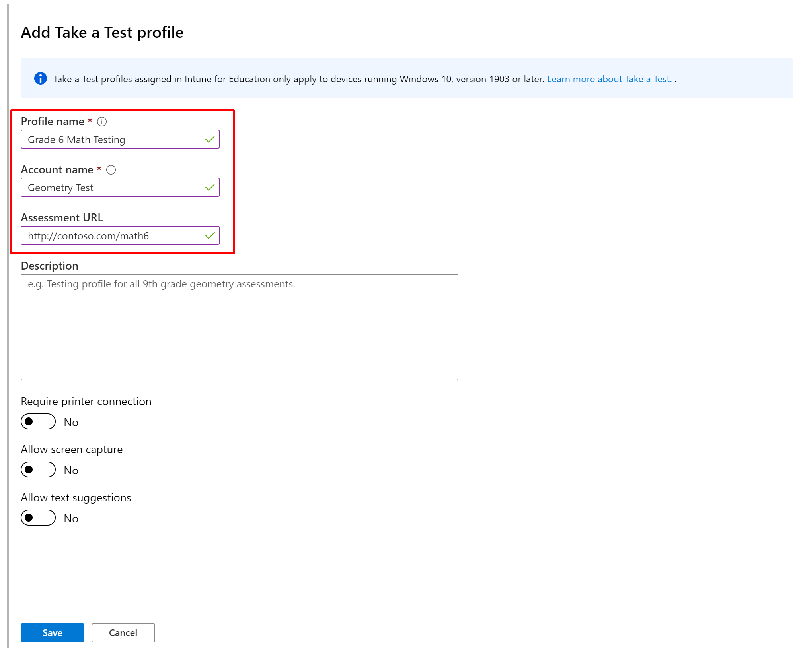
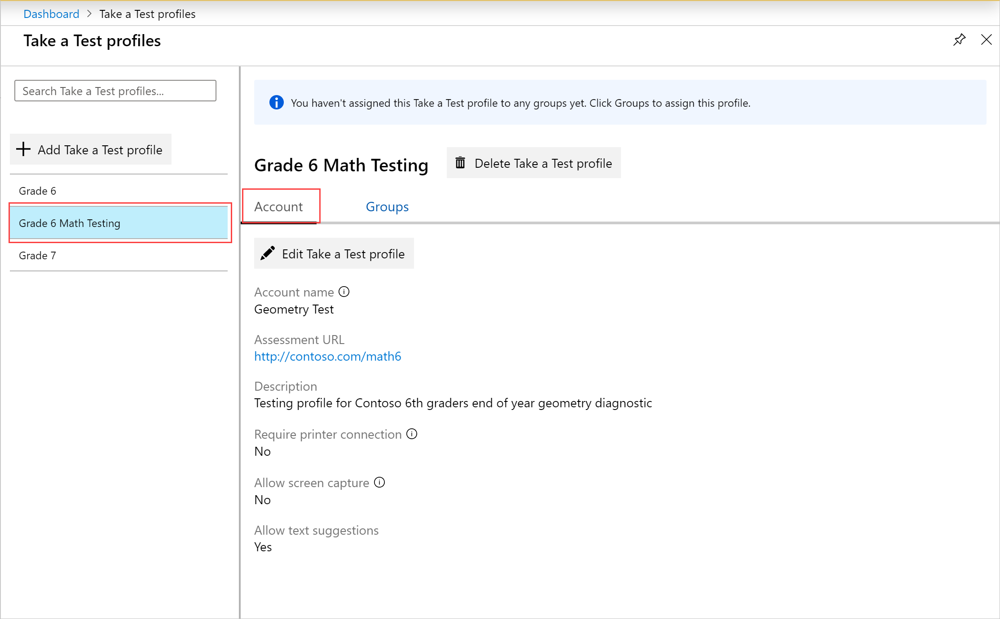

---
# required metadata

title: Take a Test profiles
titleSuffix: Intune for Education
description: Learn how to use Take A Test profiles to administer and capture student test results.
keywords:
author: lenewsad
ms.author: lanewsad
manager: dougeby
ms.date: 10/21/2019
ms.topic: article
ms.prod:
ms.service: microsoft-intune
ms.technology:
ms.assetid: 3ad65b15-015a-402e-9dd5-0748dee79459
searchScope:
- IntuneEDU

# optional metadata

#ROBOTS:
#audience:
#ms.devlang:
#ms.reviewer: rashok
#ms.suite: ems
#ms.tgt_pltfrm: 
#ms.custom: intune-education

---

# Add a Take a Test profile in Intune for Education

The Take a Test app lets you securely administer online tests on your classroom's Windows 10 devices. The test link appears as a tile at the bottom of the device’s sign-in screen. Students click the tile to launch the test. 
 
This article describes how to:
* Create a Take a Test profile.
* Assign the profile to students in your school.  

## Take a Test features
When a student launches a test, their desktop locks. The Take a Test app opens in a new window. Take a Test clears the system's clipboard so that students can't copy and paste content.

When a test is active, test takers can't:

* Visit other websites.
* Open or access other apps.
* Change settings.
* Extend the display.  
* See notifications.
* Receive app and OS updates.
* Receive text suggestions.
* Use Cortana.
* Share, print, or record device screens, unless allowed by school or IT administrator.

### How is assistive technology affected?
Some device features--such as narrator--and other assistive technology are still fully functional while taking a test. For a list of the apps features, see [Take a Test app technical reference](https://docs.microsoft.com/education/windows/take-a-test-app-technical).

## Take a Test profile setup
Follow these steps to set up a profile in Intune for Education.  

1. From Intune for Education dashboard, click **Take a Test profiles**.    

       
2.  Click Add Take a Test profile.  
    
3. Enter a descriptive name for your Take a Test profile. Students won’t see the profile name. It only appears in Intune.   
4. Enter the name of the local guest account used for testing. The name is shown on the local guest account tile on the device’s sign-in screen. Students click the tile to launch the test.  
5. Enter the Assessment URL.   

     
6. Optionally, enter a description for the Take a Test profile. Students won’t see the profile description. It only appears in Intune.  
7. Configure the rest of the test settings.    
    a. Require printer connection: Students can only access the Take a Test app from devices that are connected to a printer. This setting also makes the app’s print button available to students.  
    b. Allow screen capture: Students and teachers can use screen capture and screen recording tools in the Take a Test app. Teachers can use these tools to see what students are doing in the app.  
    c. Allow text suggestions   

To view the details of any profile, select it from the left side of the page. Then click the **Account** tab.  

   

## Assign or change groups
Assign groups of students that require access to the test profile. Follow these steps to make edits to group assignments too.
1. From the **Take a Test profiles** page, click the **Groups** tab. 
2. Click **Change group assignments**. 
3. Select one or more groups from the **All Groups** menu. Then click **Add Groups**. 
4. To remove a group from the assignment, select the group from the **Groups assigned** menu. Then click **Remove Groups**.
5. Click **Ok** to submit your changes.

> [!NOTE]
>  Intune for Education used to offer the ability to configure a Take a Test profile by specifying an Azure AD account as the test-taking account. If you already have Take a Test profiles configured in this way, you can still view the profile and assign it to groups, but you can't edit the profile in Intune for Education. To edit the profile, visit Intune in the Azure portal.  

To find out more about Take a Test on your devices, see [Take a Test in Windows 10](https://technet.microsoft.com/edu/windows/take-tests-in-windows-10).
