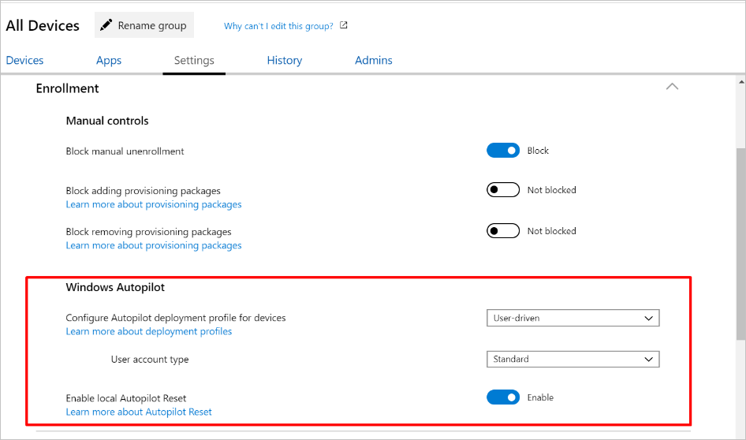
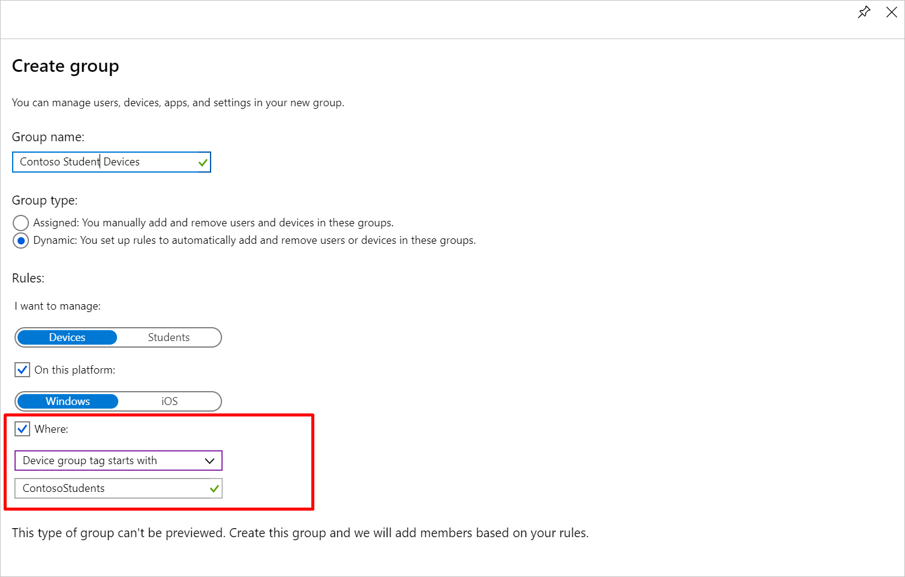
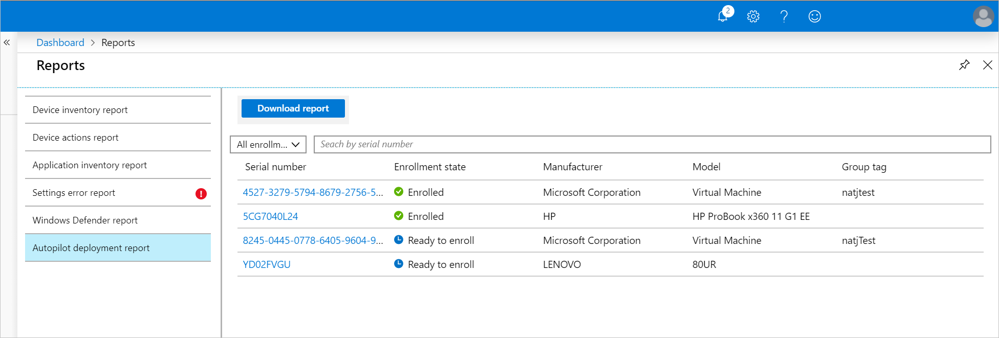
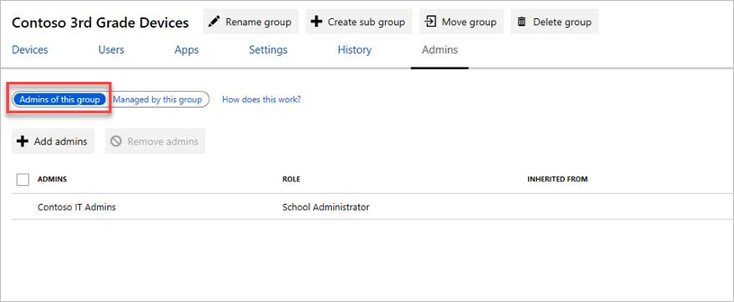
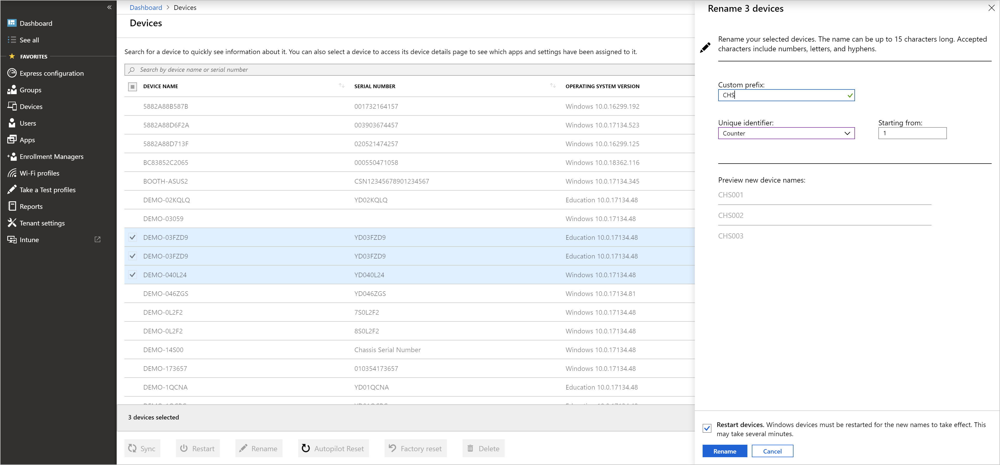
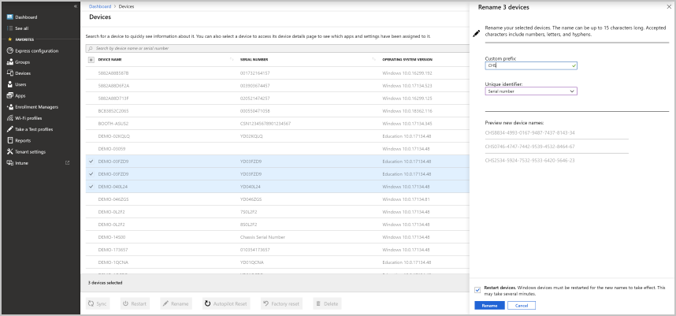
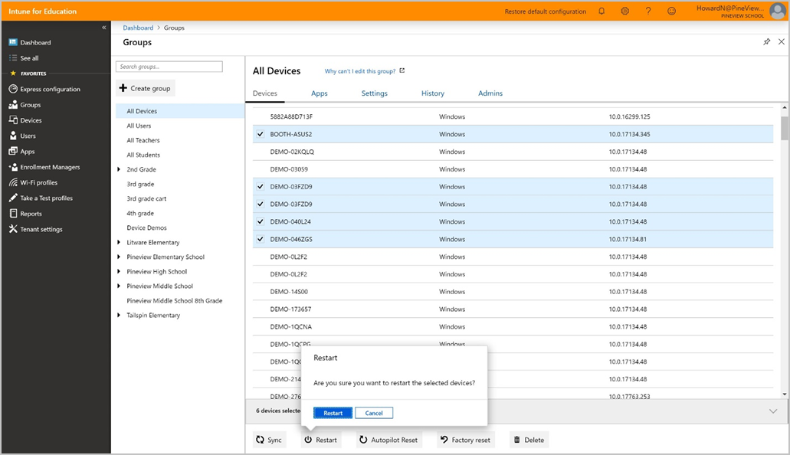
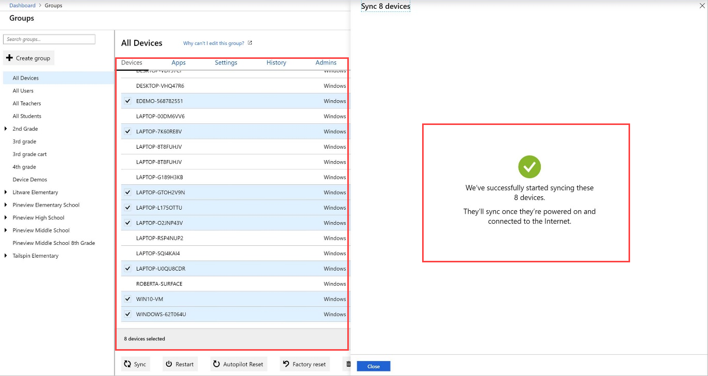
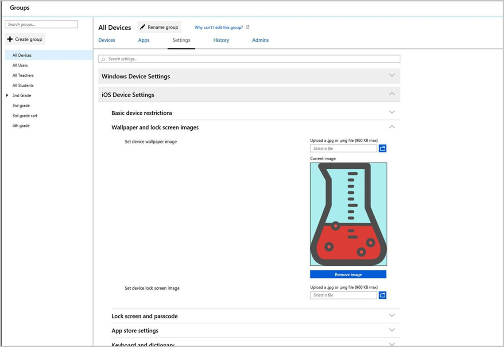

---
# required metadata

title: What's new
titleSuffix: Intune for Education
description: Find out what's recently released in Intune for Education.
keywords:
author: lenewsad
ms.author: lanewsad
manager: dougeby
ms.date: 10/21/2019
ms.topic: article
ms.prod:
ms.service: microsoft-intune
ms.technology:
ms.assetid: 7d8dfd82-8cee-4874-85f6-edaf84e49c4c
searchScope:
- IntuneEDU

# optional metadata

#ROBOTS:
#audience: 
.#ms.devlang:
#ms.reviewer: rashok
#ms.suite: ems
#ms.tgt_pltfrm:
#ms.custom: intune-education

---
# What's new in Intune for Education
Learn what’s new in Intune for Education. Find out about upcoming changes, product notices, and features from previous releases.  

## October 2019  

### View Win32 Apps from Intune for Education portal  
Yuo can now see the Win32 apps that are configured in your tenant, and manage the apps' group assignments, from the Intune for Education portal. 

### Configure Take A Test for local guest accounts  
More configuration options are available for Take a Test profiles. There's now a local guest account option so students can click a button on the Windows sign-in screen to launch a secure assessment, and skip entering a password. For more information about Take a Test, see [Take tests in Windows 10](https://docs.microsoft.com/education/windows/take-tests-in-windows-10) and [Add a Take a Test profile](take-a-test-profiles.md) in Intune for Education.  

### Changes to education presets  
After you sign up for Intune for Education, Intune preconfigures some settings in the All devices group. We’ve made changes to these presets based on customer feedback. These changes include:

* By default, enrollment of personal Windows device will be blocked to ensure personal devices are not accidentally enrolled in Intune.  
* By default, local Autopilot Reset will be disabled.  

### Manage Windows Autopilot  
From the Intune for Education portal, you can:  

* Configure Autopilot deployment profiles.  
* Create dynamic groups for Autopilot-registered devices based on group tags.  
* Monitor and review device deployments.  

  

  

  

For more information about Windows Autopilot, see [Overview of Windows Autopilot](https://docs.microsoft.com/windows/deployment/windows-autopilot/windows-autopilot).  

## August 2019  

### Change to Office 365 deployment
When you deploy Office 365 for Windows, all targeted devices, including those in S mode, will receive Office 365 ProPlus. Before this change, devices in S mode received a different version of Office 365 from the Microsoft Store for Education.  

### New admin view added to Groups page for easier admin delegation
We've added a new view so that you can more easily see, add, and remove the groups your admins manage. Go to the **Groups** page and after choosing a group, select **Admins** > **Managed by this group**. From there you can add or remove groups.  

  

## July 2019  

### Perform bulk rename  
Rename up to 100 devices at a time. To make a bulk selection, you can manually choose devices from the devices list, or hold down the **Ctrl** or **Command** key to select multiple devices at once.  

You can then apply a naming template to the group of selected devices, which includes a custom prefix appended by a unique identifier. The unique identifier can be a serial number, a counter, or a Wi-Fi MAC address.  

 
   

    

## June 2019  

### Perform bulk actions 
Perform certain remote actions on up to 100 devices at a time.  To make a bulk selection, you can manually choose devices from the devices list, or hold down the **Ctrl** or **Command** key to select multiple devices at once.  
 
   

Intune for Education will support the bulk functionality for the following device actions:  

* Restart  
* Factory reset  
* Sync  
* Autopilot Reset  
* Delete   

 

### Easier migration to Intune for Education licenses  
After you sign up for Intune for Education, Intune automatically configures some settings in the All devices group with values that are recommended for schools. Now when you add Intune for Education to a tenant that already has an Intune subscription, you'll see the recommended policies, but Intune won't assign them automatically. This change will ensure that no unwanted changes are made to your existing environment.  

### New permissions for assigned group admins  
Intune's built-in School Administrator role now has create, read, update, and delete (CRUD) permissions for Managed Apps. This update means that if you're assigned as a group admin in Intune for Education, you can now create, view, update, and delete the iOS MDM Push Certificate, iOS MDM server tokens, and iOS VPP tokens along with [all of the existing permissions you have](https://docs.microsoft.com/intune-education/group-admin-delegate#group-admin-permissions). To take any of these actions, go to **Tenant settings** > **iOS Device Management**.  

### New deployment documentation  
In the [enrollment section](https://docs.microsoft.com/intune-education/add-devices-windows) of our documentation, you'll find new information to help you compare Set up School PCs and Windows Autopilot based on your school’s environment and setup needs. Use this information to decide when to use each option, or both, for device setup. 

## May 2019   

### Distinguish between online and offline-licensed Microsoft Store for Education apps   

You'll be able to see if a Microsoft Store for Education app has an online or offline license. Intune for Education will show the license type in Express Configuration and on the app's details page, making it easier for you to manage and deploy apps to the correct groups. Apps with online licenses begin installing after a user signs in to a device and require a connection to Microsoft Store to use. Apps with offline licenses install without the need for user sign-in and don't require a connection to Microsoft Store to use.  

### New iOS settings  

New settings have been added to give you more control over the iOS Classroom app.  

### Apply an iOS device naming template  

We've added new naming settings to help you group and identify your iOS devices. During iOS enrollment and MDM server token setup, Intune for Education will automatically name each of your devices with their unique device serial number. You can then add a custom name, such as  Contoso or Math1, to the prefix. If you customize the name, the device serial number is attached to the end of it. For example: Contoso012a345b67c8. When you configure or update a naming template for an MDM Server Token, all devices associated with that token are renamed – both existing devices and those enrolled after the naming template is applied. 

## April 2019  

### Updated iOS settings names and added more tooltips  
We revised many of the iOS setting names, tooltips, and categories in Intune for Education to make settings easier to find and understand. For a detailed list of these settings, see [iOS device settings in Intune for Education](all-edu-settings-ios.md).  

### Refined list of iOS settings in Express Configuration   
We adjusted the [list of iOS settings in Express Configuration](edu-express-config-settings-ios.md) so that you can get your devices and groups set up even faster. You'll see that some settings moved out of Express Configuration, and new settings moved in. The removed settings are still available for you to configure in **Groups** > **Settings** > **iOS Device Settings**. For the full list of device settings in Intune for Education, see [iOS device settings](all-edu-settings-ios.md) and [Windows 10 device settings](all-edu-settings-windows.md).  

###  New settings for Windows 10 devices  
There are several new Windows 10 device settings. Here's just a few of the settings you can now configure in Intune for Education:
* Windows Update notifications: This setting lets you choose whether or not users see notifications about Windows Updates.  
* Manual Windows Update: This setting lets you choose whether or not users have access to the Windows Update scan, download, and install features.  

## February 2019  

### Set custom wallpaper and lock screen images for your iOS devices  
You can now use Intune for Education to set custom wallpaper and lock screen images on school devices. To upload your images, go to **Groups** > **iOS Device Settings** > **Wallpaper and lock screen images**.  

     

## January 2019  

### Set up iOS devices with Shared iPad features
When configuring settings in Intune for Education for iOS device enrollment, you now have the option to configure your iOS devices to enroll with Shared iPad features enabled.  Shared iPad is an iOS feature that requires students and teachers to sign in to school devices with a Managed Apple ID. They can sign in and out of any enabled device in the school to access saved and in-progress work, apps, and tasks. For more information about Shared iPad in Intune for Education, see [Shared iPad configuration](setup-ios-device-management.md#shared-ipad-configuration).  

### New settings for Windows 10 devices  
We've added new settings to give you more control over areas such as security, Windows updates, device sign-in, and browser experience. Here are just a few new settings you'll see this month:  

* **Configure preferred Azure Active Directory tenant domain**: This setting permits students to sign in to a device without a tenant domain name. Students can sign in quickly and easily with just their alias.  

* **Configure new tab page**: This setting lets you choose the page that opens when students add a tab in Microsoft Edge. New tabs can open a blank page or a custom one, such as your school's home page.  

* **Switch out of S Mode**: This setting lets admins switch devices out of Windows 10 in S Mode, or prevents students from switching their own devices out of S Mode.    

### Updated Windows settings names and added useful tooltips  
We revised many of the setting names and tooltips in Intune for Education to make them easier to find and understand. For even more details about each setting, see [Windows 10 device settings in Intune for Education](all-edu-settings-windows.md).  

### Rename Windows devices  
Rename any Windows 10 (version 1803 or later) device remotely from the Intune for Education portal. To rename, go to **Devices** and select a device > **Rename device**. You can also rename a device from the **Device details** page.  

## November 2018  

### Remote Autopilot Reset 
You can now invoke Autopilot Reset remotely using the Intune for Education portal. Autopilot Reset removes all user data including user-installed apps and personal settings and keeps the device enrolled in Intune so the device is kept up-to-date with all the latest apps, policies, and settings. With this feature, you can quickly wipe and reconfigure students' PCs in bulk to prepare them for a new school year. Learn more about Autopilot Reset [here](autopilot-reset.md).

### New features for iOS management
- Intune for Education now displays location information for your Apple School Manager VPP tokens, so you can easily identify your VPP tokens from both Intune for Education and Apple School Manager. 
- You can give your VPP tokens nicknames in Intune for Education for easy labeling and organization. 
- Enrollment is now even faster for your iOS devices when you set up an MDM Server Token. Intune for Education automatically configures enrollment settings, so the devices associated with the MDM Server Token have fewer Setup Assistant screens to tap through. 
 
### Delete Device
You can now delete a device in the Intune for Education portal. Deleting a device:
- unenrolls the device in Intune.
- removes the device record from Azure Active Directory so the device is no longer part of your environment.
 
### Immersive Reader for all Tenants 
Your Windows Store for Education inventory gets unlimited licenses for Immersive reader when you sign up for Intune for Education. Immersive Reader is a learning tool that creates a reading experience with accessibility and comprehensions for learners of all ages and abilities. Learn more about Immersive Reader [here](https://www.onenote.com/learningtools).
 
### Effective Policy Page
The effective policy page shows all apps and settings applied to a user/device combination based on group memberships. From this page, you can see settings that might be in conflict and troubleshoot the issues. You can reach the effective policy page in two ways:
- click on a user > **Go to user details** > choose a device that user has recently checked in with.
- click on a device > **Go to device details** > choose a user that has recently checked in on that device.

## July 2018 

### All new support for iOS classroom devices  

Intune for Education now supports iOS device management in the classroom. We've added new features and pages to Intune for Education to make the setup and management process easy for everyone involved. From the dashboard, you'll have everything you need to successfully set up, configure, and enroll devices.  

* Setup iOS device management: We've added a new page with [step-by-step guidance](setup-ios-device-management.md) to help you quickly connect your Apple accounts to Intune for Education. On-screen indicators let you clearly see the required and optional steps, the ones you've successfully completed, and the ones that are nearing expiration.
* Express configuration: Just like our Windows 10 experience, but tailored to iOS devices, [express configuration for iOS](express-configuration-intune-edu.md) helps you quickly assign and change apps and settings. Choose a group of users or devices and select from our Microsoft-recommended settings. These [recommendations are preselected](edu-express-config-settings-ios.md), but you can change them at any time to match your school's own policies.  
* Apps and settings: We've added separate app and device setting views to help you focus on either [iOS](all-edu-settings-ios.md) or [Windows 10](all-edu-settings-windows.md) device management. With added [Apple VPP support](add-vpp-apps-ios.md), you can sync your VPP-purchased apps with Intune for Education and assign them directly from the dashboard. 
* Dynamic grouping: Now you can apply a specific device platform rule to your [dynamic groups](create-groups.md#dynamic-groups). Create a rule to apply to devices or students on Windows 10 *or* iOS devices.  

Get more details and learn how to navigate new pages and workflows in the [Intune for Education](what-is-intune-for-education.md) documentation.   

## January 2018

### History of group actions taken by admins

You can now view a history of all actions taken by admins to change group admins, apps, and settings for their approved groups. You can find the log of this history in **Groups** > **History**.

### Windows Defender report

We've added a new report. On the Reports page, you can select **Windows Defender report** from the list of reports. This lets you view Windows Defender device health status for all your devices. You can see what this looks like in the [What are reports?](what-are-reports.md) doc.

### Use role-based access control to enable group admins

You can now choose groups of people to manage settings for other groups. For example, you could have a group called *High School Admins*, where the members are your team of admins for high schools in your district. The *High School Admins* group could be given permission to manage settings for groups of high school students. Find out more in the [What are groups? doc](what-are-groups.md).

### User and device search

We've added two new options to the sidebar: **Users** and **Devices**. You can use these to search for individual users or devices, and quickly open the **Details** for these items. You can add these searches to the sidebar by **See all** > **Star button (Favorite)** to add them to your favorites list.

### Remote actions

You can now take remote actions on your users and devices. Select the device you want to take action on, then choose one of the following actions from the details page:

#### Devices

- Restart
- Reset to factory settings
- Sync
- Remove from management

#### Users

- Reset password

Find out more about [remote actions](edu-device-remote-actions.md).

### Wi-Fi profiles

We've added a new option to the sidebar for **Wi-Fi profiles**. This lets you define Wi-Fi settings that you can assign to different devices, users, and groups.

## October 2017

### Dynamic groups

Define rules and we'll create groups that automatically populate based on them.

### New app status

When adding an app, you'll now see a per-device and per-user status of app installs.

### Updated details pages

Select a user or device in one of your groups. A pane will now slide up from the bottom of the screen that lets you get more information on that object, and the status of the apps and settings that you've assigned to it.

## May 2017 (initial release)

### Intune for Education is now available!

We have launched the Intune for Education portal. Intune for Education is a streamlined experience for schools and educational organizations to manage Windows 10 devices. Find out more about Intune for Education in these docs.

## Next steps

- [Find out more about Intune for Education](what-is-intune-for-education.md)
- [Find out more about the full device management experience with Intune](https://docs.microsoft.com/intune/understand-explore/introduction-to-microsoft-intune)
