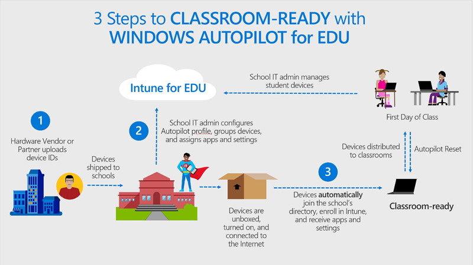
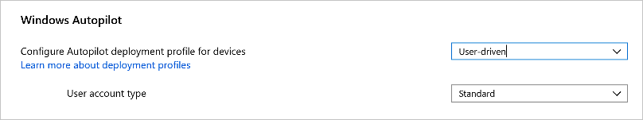
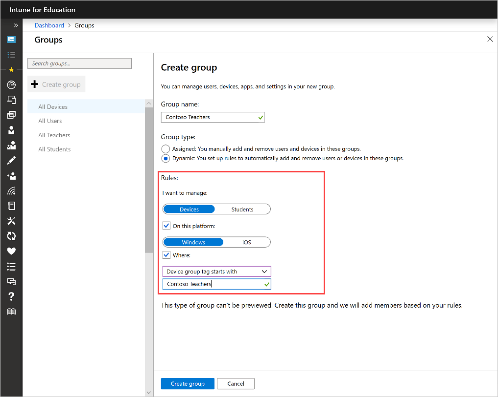

---
# required metadata

title: Set up Intune for Education devices with Windows Autopilot
titleSuffix: Intune for Education
description: Learn how to set up and deploy devices in Intune for Education with Windows Autopilot.  
keywords:
author: lenewsad
ms.author: lanewsad
manager: dougeby
ms.date: 01/20/2021  
ms.topic: article
ms.prod:
ms.service: microsoft-intune
ms.subservice: education
ms.technology:
ms.assetid: 
searchScope:
- IntuneEDU

# optional metadata

#ROBOTS:
#audience:
#ms.devlang:
#ms.reviewer: madakeva  
#ms.suite: ems
#ms.tgt_pltfrm:
#ms.custom: intune-education

---

# Set up devices with Windows Autopilot and Intune for Education   

Windows Autopilot is a cloud-based provisioning technology that's used in schools to set up and pre-configure new devices, getting them ready for productive use during the school year. Windows Autopilot was designed with school IT departments in mind and provides:   

* Easy device setup: Students power on their devices, connect them to the internet, and sign in. Windows Autopilot automatically configures each device from the cloud and gets them ready for the classroom.  

* Time and cost savings in large-scale deployments: Students and teachers can provision devices themselves. IT departments no longer need to set up provisioning in large warehouses and hire a fleet of technicians to set up student PCs.  

* Always up-to-date: Custom images and provisioning packages on USBs can quickly become outdated. With Windows Autopilot, student PCs always get configured with the latest Intune policies and apps.  

* Easy reset: Initiate a remote Windows Autopilot Reset from Intune for Education to quickly reset student PCs that are having issues. During a reset, all apps, settings, and user data are removed, while the devices remain enrolled in Azure AD and Intune. After wiping, student PCs automatically receive the latest Intune policies to get them ready for the classroom again.  

      

## Autopilot deployment in user-driven mode  
Intune for Education supports Windows Autopilot deployment profiles in user-driven mode. User-driven mode simplifies the out-of-the-box (OOBE) experience so that students and teachers can easily configure their devices. During setup, they're walked through a series of screens that instruct them to:      
   
1. Plug in device and turn it on.  
2. Choose a language.  
3. Choose a keyboard.  
4. Optionally, choose a second keyboard.  
5. Connect to a Wi-Fi network with internet access, or connect to a wired network.   
6. Type in school’s username and password.  

When they get to the enrollment status page, the device will lock until setup is complete.    

## Prerequisites 
Complete these requirements before you begin Windows Autopilot setup in Intune for Education. 

1. Meet Windows Autopilot requirements: Make sure your school and devices meet [the software, networking, licensing, and configuration requirements](https://docs.microsoft.com/windows/deployment/windows-autopilot/windows-autopilot-requirements) for Windows Autopilot.      

2. Determine user permissions: During registration, a [Microsoft partner](https://partner.microsoft.com/) will assign group tags to your devices. If you require different user permissions on different devices, instruct your partner to split the devices in to two group tags, according to permissions. Provide names for each group. For example, if teachers get admin permissions on devices and students don't, you could name one group *Contoso Teachers*, and name another *Contoso Students*.    

3. Order and register your devices: After you or the Microsoft partner orders the devices from the OEM provider, register the devices for the Autopilot deployment service. We recommend that you connect with a partner through [Microsoft Partner Center](https://partner.microsoft.com) and work with them to register the devices. The partner will obtain a CSV with the devices’ information from the OEM and then upload it to Partner Center. For detailed registration instructions, see [Adding devices to Windows Autopilot](https://docs.microsoft.com/windows/deployment/windows-autopilot/add-devices). 

4. Set up your tenant for [Intune for Education](edu-tenant-general-settings.md) and configure [School Data Sync (SDS)](https://docs.microsoft.com/schooldatasync/overview-of-school-data-sync): After it syncs your school’s information, SDS automatically creates a group for each school in the district, and creates student and teacher groups.    

5. Configure school branding: Go to the Microsoft Azure portal to add your organization’s branding to your school devices. For instructions, see [Customize your Azure AD sign-in page](https://docs.microsoft.com/azure/active-directory/fundamentals/customize-branding).  

### Things to consider  
Some factors, such as network and number of devices, could affect or delay your setup experience. Review this list of things to consider to prepare yourself. 
 
* Multiple student devices will be downloading data at the same time, which could overload your network.  
* All devices need to be plugged in or fully charged, which could be a challenge at scale.  
* Configuration can take up to one hour per device. It could take even longer if you’re downloading large apps, such as Office, or if multiple students are using the same network.   

## Configure Autopilot deployment profiles  
Complete these steps to configure an Autopilot deployment profile for a group. We recommend that you go to the All Devices group first and configure a default Autopilot deployment profile with standard user permissions. From there, you can go to other device groups and configure deployment profiles with administrator permissions.     

1. Sign in to Intune for Education and select **Groups**.  
2. Select **All Devices** from the list of groups.  
2. Select **Windows Device Settings** > **Enrollment** to open the **Windows Autopilot** settings.  

3. Next to **Configure Autopilot deployment profile for devices**, select **User-driven**. After you select this option, the user account type appears.   

     

4. By default, a **Standard** user account type is selected. If you want all users in your tenant to be admins on their devices, select **Administrator** instead.    
    * If only some of your users need to have admin permissions, create a group and deployment profile just for them. For example, if you want your staff to have admin privileges, create a group that's made up of your staff’s devices. Then complete steps 2 through 4 in this section to create a deployment profile that has an administrator user account type.  

## Create dynamic group based on group tag  
Create a dynamic group to quickly group Autopilot-registered devices. Setting a group tag rule will automatically create and populate a group with devices that you tagged during Autopilot registration. This feature eliminates the need for you to select and group devices one-by-one.    

Group tags are assigned to devices during Windows Autopilot registration. Make sure you communicate with your Microsoft partner about your need for group tags before registration begins.  

    

1. Go to **Groups** > **Create group**.  
2. Name your group.
2. Under **Group type**, select **Dynamic**. 
3. Under **Rules**:  
    a. Select **Devices**.
    b. Select **On this platform** > **Windows**   
    b. Select **Device group tag starts with** from the menu.  
    c. Type in the name of the group tag. In this example, the group tag is called *Contoso Teachers*.  
4. Select **Create group**. All Autopilot-registered devices with the specified group tag will be added to your new group. 

To configure a a Windows Autopilot deployment profile for the group, select your new group and then select 
**Windows device settings** > **Enrollment**. See [Configure Autopilot deployment profiles](#configure-autopilot-deployment-profiles) to learn how to configure these settings.   

## Configure settings and apps  
If each device in your school is used by a single user, we recommend that you:  

* Configure tenant-wide settings under the All Devices group.   
* Configure group-specific settings and apps under user groups.      
   
You can configure settings and apps under the default groups created by SDS. You can also create custom groups specific to your school system, such as *6th grade students*, and configure settings and apps there.      

If the devices in your school are shared by all students, they'll most likely have similar settings and apps. Configure all common settings and apps under the All Devices group. Configure other apps and settings in the device groups where they apply.  

## Distribute devices  
After you’re done with the configuration, and devices are delivered to each school, distribute them to students and teachers. They can set up the devices at home or at school, as long as there is a reliable network. For a brief overview of what the OOBE is like, see [User-driven mode](#autopilot-deployment-in-user-driven-mode ).    

## Monitor devices  
Go to **Reports** > **Autopilot deployment** to monitor the enrollment status of your school's devices.  

Use the report to quickly identify failed enrollments. To see more details or troubleshoot a failed enrollment, select a device name and then select **Windows Autopilot details**.    

## Troubleshoot devices  
If you experience a problem anytime during Windows Autopilot setup, see [Troubleshooting Windows Autopilot](https://docs.microsoft.com/windows/deployment/windows-autopilot/troubleshooting).  

## Windows Autopilot Reset  
When a device experiences issues during the school year, you can use Autopilot Reset to reset it to a healthy state. A reset can also be done on a group of devices. For more information, see [Autopilot Reset](autopilot-reset.md).   

 
## Next steps  
Find out about the newest Autopilot features and other changes in Intune for Education. See [What's new](whats-new-in-edu.md) for a monthly summary of all new features in Intune for Education.     

Make [changes to your groups](edu-device-remote-actions.md) and use [remote actions](edu-device-remote-actions.md) in Intune for Education.  

